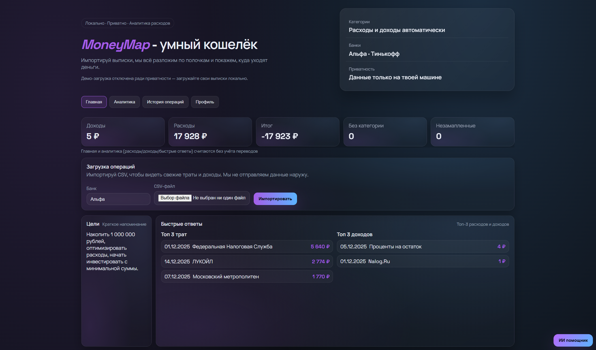
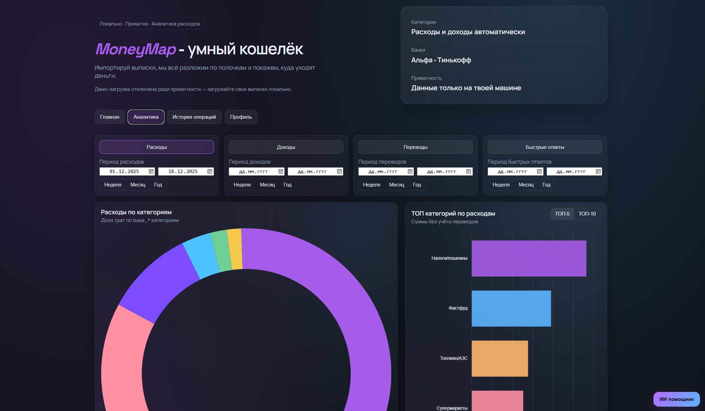
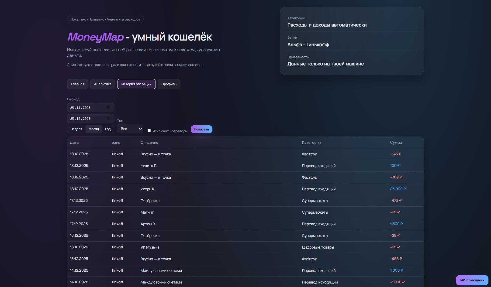
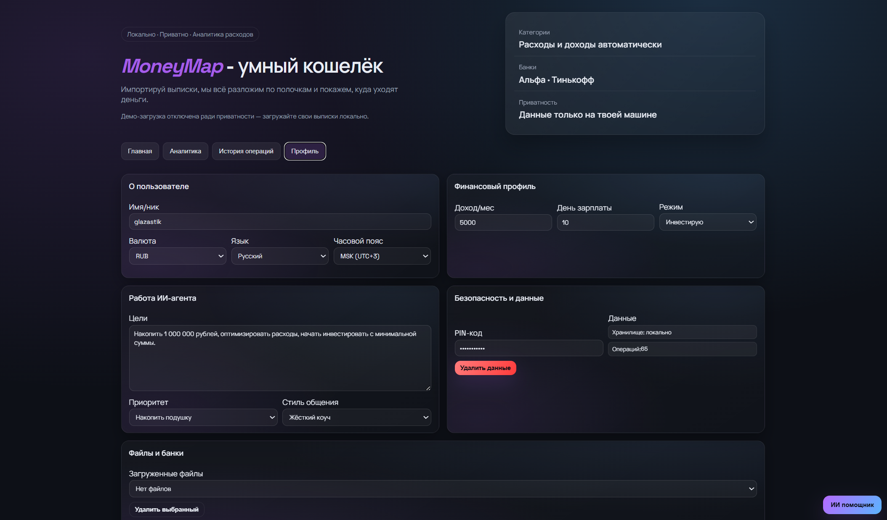

# MoneyMap — приватный анализ расходов

Локальное веб-приложение (Flask + Chart.js), которое импортирует CSV-выписки из банков (Альфа, Тинькофф), автоматически категоризирует операции и показывает аналитику. Все данные и модель остаются на вашей машине.

## Возможности
- Импорт CSV через адаптеры `finance_app/adapters/*`, создание счетов и операций в `Vault`.
- Категоризация: правила (`rules.py`), маппинг банк-категорий (`category_mapping.py`), ML-стаб/модель (`ml_model.py`), LLM-стаб (`llm_categorizer.py`), пайплайн `services/categorization.py`.
- Аналитика и быстрые ответы: сводка, тренды, разбивки по категориям, мерчанты, экспресс-ответы (`services/analytics_service.py`).
- UI: `templates/index.html`, `static/app.js`, `static/style.css`. Демо-загрузка отключена ради приватности — загружайте только свои файлы.

## Установка и запуск
```bash
python -m pip install -r requirements.txt
python app.py  # поднимет http://localhost:5000
```

## Использование
1) При первом запуске задайте пароль (хранится локально в `data/auth.json`).
2) Выберите банк и загрузите CSV с операциями.
3) Смотрите аналитику, историю и ИИ-ответы. Данные не покидают устройство.

## Скриншоты





## Тесты
```bash
python -m pytest
```

## Структура
- `app.py` — Flask-приложение: API для импорта, аналитики, auth, ML/LLM, сохранения состояния (демо-эндпоинт удалён).
- `finance_app/domain.py` — модели `Operation`, `Account`, `Category`, `Vault`.
- `finance_app/category_tree.py`, `category_mapping.py` — дерево категорий (`sys_*`, `base_*`), маппинг банк-категорий → базовые.
- `finance_app/rules.py`, `services/categorization.py` — правила и пайплайн категоризации (правила → маппинг → ML/LLM → фолбэк).
- `finance_app/services/analytics_service.py` — сводки, тренды, разбивки, быстрые ответы; `storage.py` — сохранение/загрузка состояния; `ml_model.py`, `llm_categorizer.py` — ML/LLM; `import_service.py` — импорт CSV.
- `finance_app/adapters/` — парсеры CSV (Альфа, Тинькофф); `static/`, `templates/` — фронтенд (без кнопки демо).
- `tests/` — pytest для утилит, категорий/маппинга, правил, пайплайна, ML/LLM, импорта, аналитики, сторейджа.
- `docs/screenshots/` — изображения для README.

## Лицензия
MIT, см. файл `LICENSE`.
