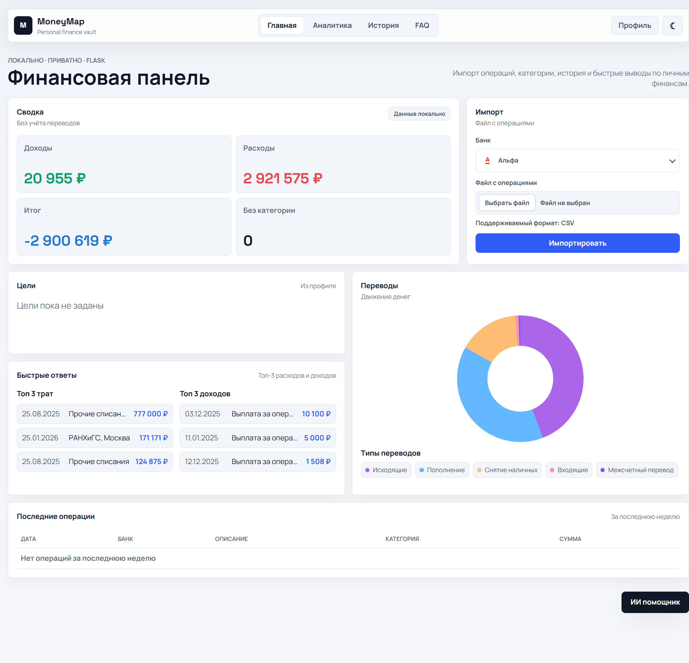
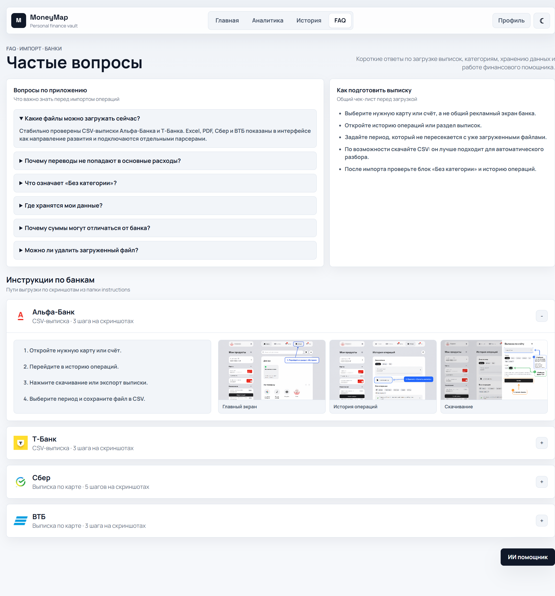

# MoneyMap v2

MoneyMap is a privacy-first local web application for personal finance analysis. It imports bank statements, normalizes transactions, categorizes spending, displays analytics, and provides personal finance answers through an AI assistant.

By default, user data stays on the local machine. Bank statements, local state, auth files, API tokens, and trained model files are excluded from the repository.

## Features

- Import statements from Alfa Bank, T-Bank, Sber, and VTB.
- Detect duplicate files by SHA-256 content hash, not by filename.
- Skip duplicate operations when statement periods overlap.
- Categorize transactions with rules, bank-category mappings, ML helpers, and optional LLM helpers.
- Analyze expenses, income, transfers, subscriptions, history, and period trends.
- Store a financial profile: income, payday, goal, deadline, priority, and communication tone.
- Use a tiered AI assistant:
  - factual dashboard-level answers are handled locally;
  - analytical questions can use aggregated data plus an LLM.
- Protect the local app with a password-based session.

## Screenshots

### Main Dashboard



### FAQ And Bank Export Instructions



## Stack

- Python 3.12
- Flask
- Chart.js
- scikit-learn
- openpyxl
- pypdf
- pytest

## Installation

```powershell
python -m venv .venv
.\.venv\Scripts\Activate.ps1
python -m pip install -r requirements.txt
```

## Run

Recommended:

```powershell
python -m flask --app app run --host 127.0.0.1 --port 5059
```

Open:

```text
http://127.0.0.1:5059
```

Direct launch is also supported:

```powershell
python app.py
```

It uses the same local port, `5059`.

## LLM Configuration

The assistant can work without an API key for local factual and fallback analytical answers. For LLM-backed answers, configure environment variables or keep a local ignored token file.

Example:

```text
AGENT_LLM_API_KEY=
AGENT_LLM_MODEL=llama-3.1-8b-instant
AGENT_LLM_API_URL=https://api.groq.com/openai/v1/chat/completions
```

Local files matching `token_model_*.txt` are ignored by Git.

## Private Data Policy

The repository must not contain:

- `operations/` bank statements
- `data/` local state and auth files
- `token_model_*.txt` API token files
- `.env` files
- local IDE settings
- trained model files such as `models/*.pkl`

Useful checks before publishing:

```powershell
git status --short
git ls-files token_model_*.txt operations data
```

## Tests

```powershell
python -m pytest -q
```

## Project Structure

- `app.py` - Flask API and app entrypoint.
- `finance_app/domain.py` - domain entities and duplicate operation protection.
- `finance_app/adapters/` - bank statement parsers.
- `finance_app/services/import_service.py` - import and categorization flow.
- `finance_app/services/analytics_service.py` - dashboard and analytics calculations.
- `finance_app/services/agent_service.py` - AI assistant logic.
- `finance_app/services/storage.py` - local state persistence.
- `finance_app/static/` and `finance_app/templates/` - frontend.
- `tests/` - automated tests.

## Dataset Dry Run

If you have a local ignored `operations/` folder, run:

```powershell
python scripts/check_operations_dataset.py
```

## License

MIT. See `LICENSE`.
