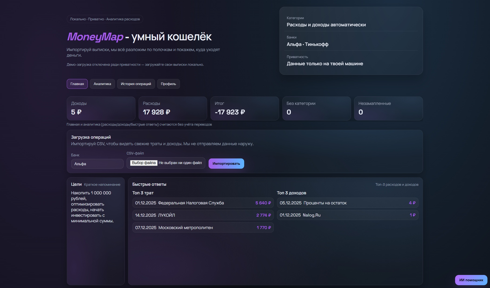
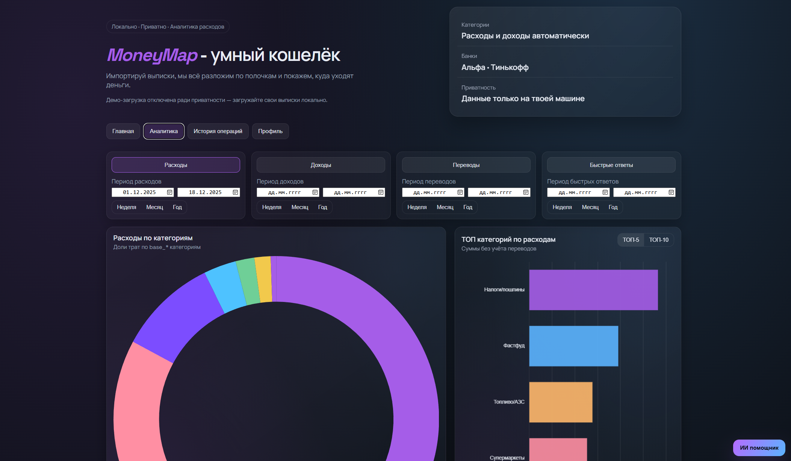
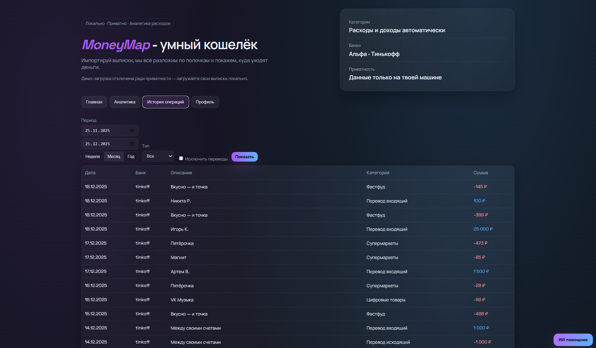
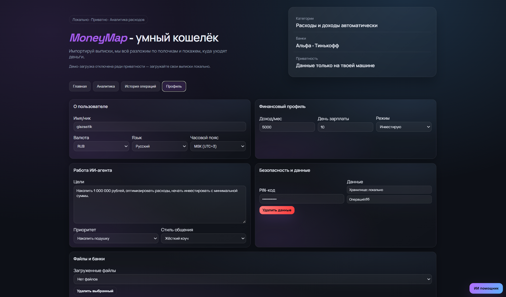

# MoneyMap — приватный анализ расходов

Веб-приложение (Flask + PostgreSQL + SQLAlchemy + Chart.js), которое импортирует банковские выписки, автоматически категоризирует операции и показывает аналитику по расходам. Данные разделены по пользователям: операции, файлы, профиль и ручные правки привязаны к аккаунту.

## Возможности

- Регистрация и вход по `email + password`, пароли хешируются через Argon2id, сессии через токены.
- Импорт выписок через адаптеры `finance_app/adapters/*`, сохранение счетов и операций в БД.
- Категоризация: правила (`rules.py`), маппинг банк-категорий (`category_mapping.py`), ML-стаб/модель (`ml_model.py`), LLM-стаб (`llm_categorizer.py`), пайплайн `services/categorization.py`.
- Аналитика и быстрые ответы: сводка, тренды, разбивки по категориям, мерчанты, подписки, экспресс-ответы (`services/analytics_service.py`).
- UI: `templates/index_bento.html`, `static/app_bento.js`, `static/style_bento.css`.

## Установка и запуск

```bash
python -m pip install -r requirements.txt
python app.py  # http://127.0.0.1:5059
```

Запуск с PostgreSQL через Docker:

```bash
docker compose up --build
```

По умолчанию `docker-compose.yml` поднимает PostgreSQL и передаёт приложению `DATABASE_URL`. При локальном запуске без `DATABASE_URL` используется SQLite-файл `data/moneymap.db`, чтобы проект можно было быстро открыть без Docker.

## Использование

1) При первом запуске зарегистрируйтесь по email и паролю.
2) Выберите банк и загрузите выписку в формате, который поддерживает парсер.
3) Смотрите аналитику, историю, профиль и AI-ответы. Данные одного пользователя не видны другим.

## Скриншоты






## Тесты

```bash
python -m pytest
pytest
```

## Структура

- `app.py` — Flask-приложение: API для регистрации, входа, импорта, аналитики, истории, профиля и AI-помощника.
- `finance_app/domain.py` — модели `Operation`, `Account`, `Category`, `Vault`.
- `finance_app/category_tree.py`, `category_mapping.py` — дерево категорий (`sys_*`, `base_*`), маппинг банк-категорий → базовые.
- `finance_app/rules.py`, `services/categorization.py` — правила и пайплайн категоризации (правила → маппинг → ML/LLM → фолбэк).
- `finance_app/services/database.py` — SQLAlchemy-модели и функции работы с PostgreSQL/SQLite.
- `finance_app/services/analytics_service.py` — сводки, тренды, разбивки, быстрые ответы; `ml_model.py`, `llm_categorizer.py` — ML/LLM; `import_service.py` — импорт файлов.
- `finance_app/adapters/` — парсеры выписок банков; `static/`, `templates/` — фронтенд.
- `tests/` — pytest для утилит, категорий/маппинга, правил, пайплайна, ML/LLM, импорта, аналитики, сторейджа.
- `docs/screenshots/` — изображения для README.

## Лицензия

MIT, см. файл `LICENSE`.

## Dataset Dry Run

If you have a local dataset in `operations/`, run a batch import + analytics check:

```bash
python scripts/check_operations_dataset.py
```

Optional arguments:

```bash
python scripts/check_operations_dataset.py --folder operations --model-path models/expense_clf.pkl
```
